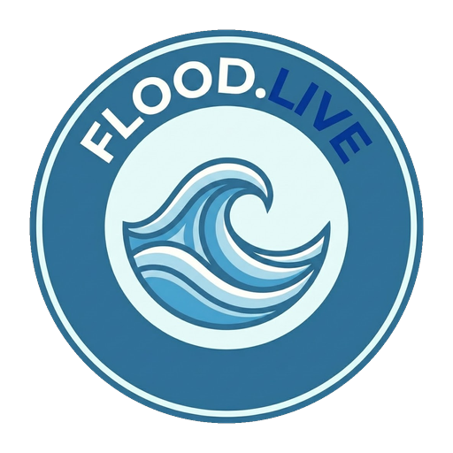

<table align="center">
  <tr>
    <td align="center" valign="middle">
      <a href="https://geolibre.app"></a>
    </td>
    <td align="center" valign="middle" width="120">
      
    </td>
    <td align="center" valign="middle">
      <a href="https://flood.live"></a>
    </td>
  </tr>
</table>
<p align="center">A GeoLibre plugin by flood.live</p>

# US Live Flood Gauges — a GeoLibre plugin

**By [flood.live](https://flood.live)** — real-time US flood monitoring
with email alerts · made by [chuofringer](https://github.com/chuofringer)
([vibemapper.dev](https://vibemapper.dev))

A live layer of 10,000+ US river and coastal flood gauges from NOAA/NWPS
on your [GeoLibre](https://geolibre.app) map, with flood-category
symbology, per-gauge hydrographs, and shareable deep links. Want alerts
when a gauge near you rises? That's what
[flood.live](https://flood.live) does.

> **Source:** NOAA/NWPS river and coastal gauges (`api.water.noaa.gov`) ·
> MapServer every 30 min.
>
> **For informational purposes only.** Not for life-safety decisions.
> Follow official NOAA and local emergency guidance.

At low zoom the map shows an **H3 flood overview** (ported from
flood.live's hex presentation): only regions with active flood
conditions light up, colored by the worst gauge status in each cell —
quiet country stays clean. Click a hex to ease in +2 (national ~2 → ~4 →
~6); from zoom 6 the individual gauge dots take over, and clicking a
dot opens its panel.

This plugin ports flood.live's production domain logic (flood-category
thresholds, trend detection, NOAA fetch pipeline) into GeoLibre; every
ported file carries a `// Source of truth: flood.live <path>` header
noting any deviation.


## Data & provenance

- **Source:** NOAA/NWPS river and coastal gauges. Gauge points and
  current status: NOAA MapServer (`mapservices.weather.noaa.gov`),
  refreshed every 30 minutes. Thresholds and hydrographs:
  `api.water.noaa.gov`.
- **For informational purposes only.** Not for life-safety decisions.
  Follow official NOAA and local emergency guidance. The same lines
  are on the gauge panel.

## Install

- **Registry** — coming soon (pending the `opengeos/geolibre-plugins`
  registry PR).
- **Side-load a zip** — download a release's
  `geolibre-flood-gauges-<version>.zip` from the
  [Releases](../../releases) page and choose it under **Install from
  file** in GeoLibre's plugin manager.
- **Manifest URL** — Settings → Manage Plugins → Settings tab →
  Manifest URLs. Paste a `plugin.json` you're serving (local stack:
  `http://localhost:8000/plugin.json`). Reload if it doesn't show in
  the Plugins menu, then toggle **US Live Flood Gauges** on. The
  manager's Installed count often stays 0 — that's a GeoLibre host
  quirk, not a failed install.

## Usage

A status chip shows only while NOAA is loading or failed — **Loading
gauges…** on first load (**Refreshing gauges…** after that). It hides
when NOAA is healthy. If the fetch fails or is aborted after ~45s, the
chip shows **Unable to reach NOAA.** (or **Unable to reach NOAA. Showing
last load.** when a prior load exists) and **Retry**.

Click any gauge dot to open its panel: category badge, color stage bar
with Action / Minor / Moderate / Major tick labels, staleness indicator,
and a hydrograph.

NOAA `-999` sentinels (and other missing observations) show
**Observed: –**. The hydrograph is omitted rather than left as a blank
hole; the stage bar still draws if thresholds exist (no marker).

Deep link straight to a gauge:

```
https://web.geolibre.app/?flood-gauge=PTTP1
```

`flood-gauge` takes a NOAA gauge LID (letters/digits, up to 10
characters). An unknown or invalid LID opens the panel with **No gauge
found for this id.** (plus a NOAA LID hint). The panel footer is
**Open on flood.live** — it opens that gauge on flood.live (`?gauge=` +
`ref=geolibre`).

## Development

This repo builds a GeoLibre plugin bundle only — there's no standalone
dev server; iterate with `build:geolibre` + `serve:geolibre` against a
GeoLibre checkout.

```bash
npm install
npm run build:geolibre  # -> geolibre-plugin/dist/{index.js,style.css}
npm run serve:geolibre   # CORS static server; prints a manifest URL you
                          # paste into Settings → Manage Plugins →
                          # Settings → Manifest URLs
npm run package:geolibre # -> geolibre-plugin/geolibre-flood-gauges-<version>.zip
npm run lint
npm run typecheck
```

The vendored GeoLibre host contract lives in `src/host/geolibre-api.ts`
(types only, no runtime) — see that file's header for why it's vendored
rather than imported from `geolibre-plugin-template`.

## Testing

```bash
npm test          # vitest: unit, network-contract, and host-contract suites
npm run test:e2e   # Playwright smoke vs. a real GeoLibre build (see below)
npm run canary      # live NOAA shape/recency check (no mocks)
```

- **Unit + network-contract + host-contract** (`tests/`) run on every PR:
  ported flood.live logic, NOAA pagination/error handling, and the full
  plugin lifecycle against a `FakeHost` harness (`tests/support/fakeHost.ts`)
  covering registration, teardown, deep links, and project-state edge
  cases.
- **End-to-end** (`e2e/`, Playwright) runs nightly and on `src/` PRs
  against a real, pinned GeoLibre web build with NOAA traffic stubbed via
  route interception. It accepts a `GEOLIBRE_URL` env override so you can
  point it at an already-running local GeoLibre dev server instead of the
  CI-managed checkout:

  ```bash
  GEOLIBRE_URL=http://localhost:5173 npm run test:e2e
  ```

- **NOAA canary** (`scripts/noaa-canary.mjs`) runs weekly against the
  live NOAA endpoints (no mocks) and opens an issue on failure. Run it
  with `--record` to refresh the fixtures in `tests/fixtures/` and
  `e2e/fixtures/` from live data.
- **Package/registry conformance** (`scripts/validate-plugin.mjs`) runs
  after every build in CI: imports the bundle, checks id/name/version
  consistency across `plugin.json`/`package.json`/the exported plugin
  object, and enforces a 1 MB bundle budget.

## License

MIT — see [LICENSE](LICENSE).

Made by [chuofringer](https://github.com/chuofringer) · [vibemapper.dev](https://vibemapper.dev)
